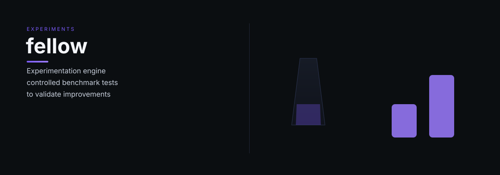

# fellow

fellow — Fellow: experimentation engine — runs controlled benchmark experiments to validate skill improvements.

> Tell it what you need. It does the work.

## What it does

Fellow is the empirical testing arm of the OCAS self-improvement loop. It receives experiment requests (typically routed through Mentor), designs controlled benchmarks, executes them, and measures outcomes. Results flow back to Mentor for evaluation and potential promotion.

## Dependencies

- [Mentor](https://github.com/indigokarasu/mentor) — receives experiment requests
- Target skills under evaluation

---

*Fellow is part of the [OCAS Agent Suite](https://github.com/indigokarasu).*

---

*fellow is part of the [OCAS Agent Suite](https://github.com/indigokarasu).*